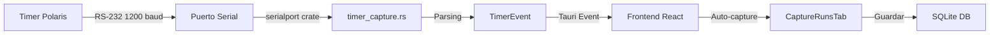

# Integración del Timer Polaris de FarmTek

## 📋 Resumen

RopemasterV2 ahora soporta captura automática de tiempos desde el **Timer Polaris de FarmTek** mediante conexión serial RS-232.

---

## ✅ Implementación Completada

### Backend (Rust/Tauri)

1. **Módulo `timer_capture.rs`**
   - Gestión de conexión serial (1200 baud, 8N1)
   - Parsing flexible de formatos de tiempo:
     - `103.474` (segundos.milisegundos)
     - `103.47` (segundos.centésimas)
     - `1:43.474` (minutos:segundos.milisegundos)
     - `1:43.47` (minutos:segundos.centésimas)
   - Filtrado de caracteres de control de impresora
   - Captura asíncrona en thread separado

2. **Comandos Tauri Expuestos**
   - `list_serial_ports()` - Lista puertos COM disponibles
   - `connect_timer(port_name)` - Conecta al timer
   - `disconnect_timer()` - Desconecta el timer
   - `is_timer_connected()` - Verifica estado de conexión
   - `start_timer_capture()` - Inicia captura de eventos

3. **Eventos Emitidos**
   - `timer-event` - Emitido cuando se captura un tiempo
     ```typescript
     {
       time_seconds: 103.474,
       raw_text: "  \x1B\x1E103.474\r",
       timestamp: "2026-02-04T12:34:56Z"
     }
     ```

### Frontend (React/TypeScript)

1. **Componente `CaptureRunsTab`**
   - Selector de modo: **Manual** vs **Timer Externo**
   - Panel de configuración del timer con:
     - Lista de puertos seriales disponibles
     - Botón de conexión/desconexión
     - Indicador de estado (conectado/desconectado)
   - Captura automática de eventos del timer
   - Visualización en tiempo real del tiempo capturado

2. **API Frontend (`api.ts`)**
   - Interfaces TypeScript para datos del timer
   - Funciones wrapper para comandos Tauri

---

## 🔌 Hardware Requerido

### Cable del Timer Polaris
- **Salida:** Output Jack del Timer Console
- **Formato:** RS-232
- **Adaptador:** Serial-to-USB (incluido con el cable de FarmTek)
- **Configuración:** 1200 baud, 8N1 (8 bits, sin paridad, 1 stop bit)

### Dispositivos Compatibles
- ✅ FarmTek Polaris Timer Console
- ✅ Electric Eyes (comunicación RF con console)
- ✅ Handswitch inalámbrico

---

## 🚀 Uso

### 1. Conectar el Hardware
```
[Polaris Timer Console]
        ↓ (Output Jack)
   [Cable RS-232]
        ↓
   [Adaptador USB]
        ↓
    [PC - Puerto COM]
```

### 2. Configurar en la Aplicación

1. Abre un evento en RopemasterV2
2. Ve a la pestaña **"Captura"**
3. Cambia el modo a **"Timer Externo"** (selector en la parte superior)
4. Haz clic en **"Configurar Timer"**
5. Selecciona el puerto COM correcto (ej: `COM3`, `COM5`)
6. Haz clic en **"Conectar Timer"**
7. Verifica que aparezca el badge verde: **"Timer Conectado"**

### 3. Capturar Tiempos

1. Selecciona un equipo de la lista
2. El sistema quedará esperando el evento del timer
3. Cuando el timer se detenga, el tiempo se capturará **automáticamente**
4. El tiempo aparecerá en el campo de captura
5. Ajusta penalizaciones si es necesario
6. Guarda el run con el botón **"Guardar Run"**

---

## 📊 Flujo de Datos



---

## 🛠️ Configuración Técnica

### Protocolo Serial (Según FarmTek)

**Parámetros:**
```
Baud Rate:    1200
Data Bits:    8
Parity:       None
Stop Bits:    1
Flow Control: None
```

**Formato de Mensajes:**
- Terminación: `\r` (Carriage Return)
- Caracteres de control: 2 bytes antes del tiempo (modo impresora)
- Líneas vacías: Ignoradas automáticamente

**Ejemplos de Mensajes Recibidos:**
```
\x1B\x1E103.474\r      → 103.474 segundos
\x1B\x1E1:43.47\r      → 1 min 43.47 seg = 103.47 segundos
NO TIME\r               → Ignorado (no es tiempo válido)
```

---

## 🐛 Solución de Problemas

### El timer no se conecta
- ✅ Verifica que el cable esté conectado al **Output Jack** (no al Audio Jack)
- ✅ Asegúrate de que el adaptador USB esté reconocido por Windows
- ✅ Refresca la lista de puertos con el botón **"Actualizar Lista"**
- ✅ Prueba con diferentes puertos COM si tienes varios

### No se capturan tiempos
- ✅ Verifica que el badge diga **"Timer Conectado"** (verde)
- ✅ Asegúrate de haber hecho clic en **"Conectar Timer"**
- ✅ Verifica que el Timer Console esté encendido
- ✅ Prueba presionando START/STOP en el console manualmente

### Tiempos incorrectos
- ✅ El parsing soporta múltiples formatos automáticamente
- ✅ Si ves tiempos extraños, revisa el campo `raw_text` en los logs
- ✅ Reporta el formato no reconocido para agregar soporte

### Conexión se pierde
- ✅ Revisa que el cable USB no se desconecte
- ✅ Desconecta y vuelve a conectar desde la app
- ✅ Reinicia el Timer Console si es necesario

---

## 🔧 Desarrollo y Mantenimiento

### Agregar Soporte para Nuevos Formatos

Si el timer envía tiempos en un formato no soportado, edita:

**Archivo:** `src-tauri/src/timer_capture.rs`

```rust
fn parse_timer_line(line: &str) -> Option<TimerEvent> {
    // Agregar lógica de parsing aquí
}
```

### Tests Unitarios

```bash
cd src-tauri
cargo test timer_capture
```

### Logs de Debug

Los eventos del timer se registran en la consola:
```
Timer event: 103.474 sec (  103.474)
```

---

## 📚 Referencias

- **Manual del Timer Polaris:** Contactar a FarmTek (farmtek.net)
- **Software de Prueba:** [TimerLog.zip](https://farmtek.net/download/TimerLog.zip)
- **Contacto FarmTek:** Para documentación adicional del protocolo

---

## ✨ Ventajas de esta Integración

| Característica | Manual | Timer Externo |
|---------------|--------|---------------|
| **Precisión** | ±0.1s (humana) | ±0.001s (electrónica) |
| **Velocidad** | Lenta | Instantánea |
| **Errores** | Frecuentes | Mínimos |
| **Profesionalismo** | Casual | Competencia oficial |
| **Costo** | Gratis | Requiere hardware |

---

## 📝 Notas Importantes

1. **Un solo timer:** Solo se puede conectar un timer a la vez
2. **Modo híbrido:** Puedes cambiar entre manual y externo en cualquier momento
3. **Compatibilidad:** Funciona en Windows con cualquier adaptador Serial-to-USB
4. **Sin modificaciones:** No requiere modificar el Timer Polaris
5. **Bidireccional:** Solo lectura (no se controla el timer desde la app)

---

## 🎯 Próximos Pasos Sugeridos

- [ ] Agregar auto-save opcional al capturar tiempo
- [ ] Soporte para múltiples timers simultáneos
- [ ] Integración con scoreboards externos
- [ ] Historial de eventos raw del timer
- [ ] Calibración y offset de tiempos

---

**Implementado:** 4 de febrero de 2026  
**Versión:** RopemasterV2  
**Estado:** ✅ Producción
